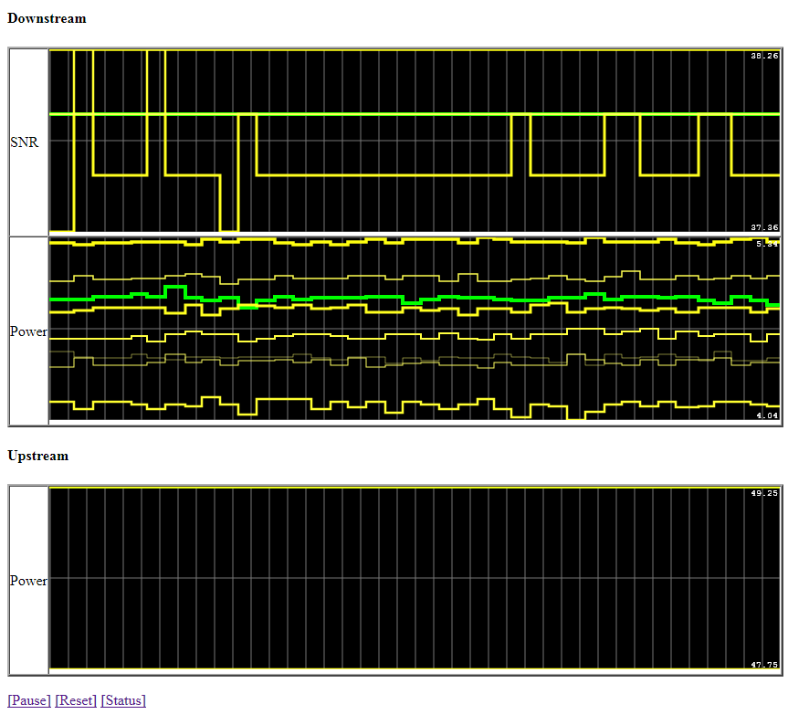

# Arris Monitor

Streaming ARRIS CM820B Cable Modem data into live charts.

## Usage

```
> go build arris_mon.go
> ./arris_mon
# Open http://127.0.0.1:81 in your browser
```



## System

* ARRIS EuroDOCSIS 3.0 Touchstone WideBand Cable Modem
* MODEL: CM820B
* Firmware Name:	TS0705125_062314_WBM760_CM820